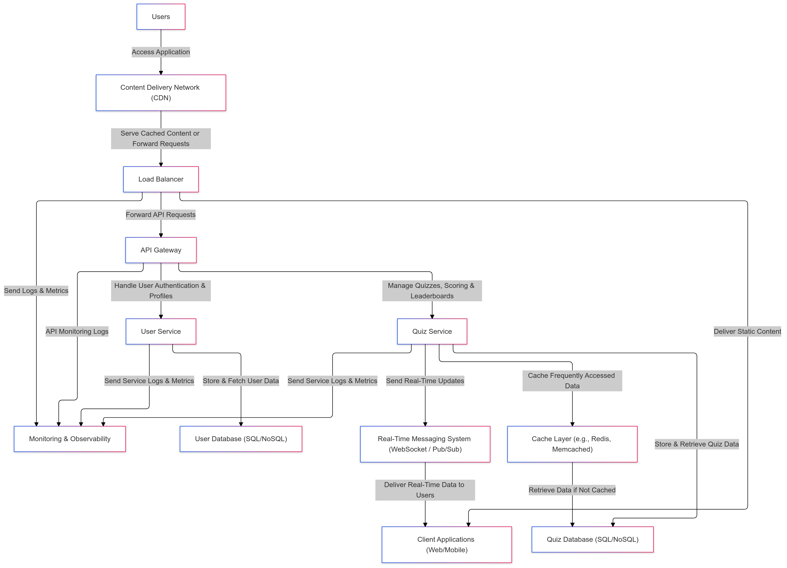

## Solution
- Requirements: [requirements.md](requirements.md)

### System Design Document
#### Architecture Diagram

#### Component Descriptions
The real-time quiz feature consists of the following components:
- **Users**: The end-users who participate in the quiz sessions.
- **Client Applications (Web/Mobile)**: The front-end applications that users interact with to join quizzes, submit answers, and view leaderboards. These applications can be web-based or mobile applications. They are responsible for rendering the user interface and handling user interactions.
- **Content Delivery Network (CDN)**: Serves static assets like images, CSS, and JavaScript files to users. It helps in reducing latency and improving the performance of the client applications.
- **Load Balancer**: Distributes incoming traffic across multiple servers to ensure optimal resource utilization, reliability, and scalability.
- **API Gateway**: Acts as a single entry point for all API requests from the client applications. It handles user authentication, manages quizzes, scoring, and leaderboards, and forwards requests to the appropriate services, such as the User Service and Quiz Service.
- **User Service**: Manages user authentication, user profiles, and user-related data. It interacts with the User Database to store and fetch user data.
- **Quiz Service**: Manages quizzes, scoring, and leaderboards. It interacts with the Quiz Database to store and retrieve quiz-related data. The Quiz Service also caches frequently accessed data using the Cache Layer and sends real-time updates to users via the Real-Time Messaging System.
- **Cache Layer**: Stores frequently accessed data to reduce latency and improve performance. It acts as a middle layer between the Quiz Service and the Quiz Database.
- **Quiz Database (SQL/NoSQL)**: Stores quiz-related data, such as quiz questions, answers, scores, and leaderboard information.
- **User Database (SQL/NoSQL)**: Stores user-related data, such as user profiles, authentication details.
- **Real-Time Messaging System (WebSocket / Pub/Sub)**: Delivers real-time updates to users, such as score updates and leaderboard changes. It ensures that users receive real-time data without the need to refresh the page.
- **Monitoring & Observability**: Collects logs and metrics from different components of the system to monitor performance, diagnose issues, tracing, and debugging, ensuring the system's reliability and availability.

#### Data Flow
1. **User Authentication & Quiz Participation**:
   - Users access the client applications (web/mobile) and authenticate themselves.
   - The client applications interact with the API Gateway to handle user authentication and profile management.
   - Upon successful authentication, users join a quiz session by providing a unique quiz ID.
   - The API Gateway forwards the quiz participation request to the Quiz Service.
   - The Quiz Service interacts with the Quiz Database to retrieve quiz-related data and manages the user's participation in the quiz session.

2. **Real-Time Score Updates**:
    - As users submit answers to quiz questions, the client applications send the answers to the Quiz Service.
    - The Quiz Service calculates the scores based on the submitted answers and updates the user's score in the Quiz Database.
    - The Quiz Service sends real-time score updates to the Real-Time Messaging System.
    - The Real-Time Messaging System delivers the score updates to the client applications in real-time, ensuring that users see their scores updated without page refreshes.

3. **Real-Time Leaderboard Updates**:
    - The Quiz Service updates the leaderboard based on the latest scores of all participants.
    - The Quiz Service sends real-time leaderboard updates to the Real-Time Messaging System.
    - The Real-Time Messaging System delivers the leaderboard updates to the client applications in real-time, ensuring that users see the current standings of all participants.

#### Technologies and Tools
- **Client Applications (Web/Mobile)**: I chose React.js for web applications because of its component-based architecture and rich ecosystem of libraries and tools. For mobile applications, I would use React Native for cross-platform development. We also can use shared components between web and mobile applications because of React's component reusability.
- **Content Delivery Network (CDN)**: I would use a CDN like Cloudflare to cache and deliver static assets to users globally, reducing latency and improving performance.
- **Load Balancer**: Depending on the cloud provider, if using Amazon Web Services (AWS), we would use Elastic Load Balancing (ELB). If using Google Cloud Platform (GCP), we would use Google Cloud Load Balancing. These services are native to their respective cloud providers and provide automatic scaling, high availability, and fault tolerance.
- **API Gateway**: We would use Amazon API Gateway if using AWS or Google Cloud Endpoints if using GCP. These services provide a managed API gateway that handles API requests, authentication, rate limiting, and monitoring.
- **User Service**: For user authentication and profile management, we would use Golang with the Gin framework and MongoDB for the User Database. Golang is known for its performance and concurrency support, making it suitable for handling user requests. MongoDB is a NoSQL database that provides flexibility and scalability for storing user data.
- **Quiz Service**: For managing quizzes, scoring, and leaderboards, we would use Node.js with Express.js and websockets for real-time updates. We would use MongoDB for the Quiz Database and Redis for the Cache Layer. 
- **Real-Time Messaging System**: We would use WebSockets for real-time communication between the Quiz Service and client applications. WebSockets provide full-duplex communication channels over a single TCP connection, enabling real-time updates without polling.
- **Monitoring & Observability**: If the optimized cost is a priority, we would use Prometheus for monitoring and Grafana for visualization. Otherwise, we would use Datadog for a more comprehensive monitoring solution.

### Implementation
- **Technology Stack**:
  - **Frontend**: React.js with Socket.IO Client for real-time communication. [Code](frontend)
  - **Quiz Service**: Node.js with Express.js and Socket.IO for real-time messaging. [Code](quiz-service)
  - **Database**: MongoDB for storing quiz data.
  - **Real-Time Messaging**: Socket.IO for real-time updates.

- **Features**:
  - **Real-time Quiz Participation**: Users can join a quiz session using a unique quiz ID.
  - **Real-time Score Updates**: Users' scores are updated in real-time as they submit answers.
  - **Real-time Leaderboard**: A leaderboard displays the current standings of all participants in real-time.
